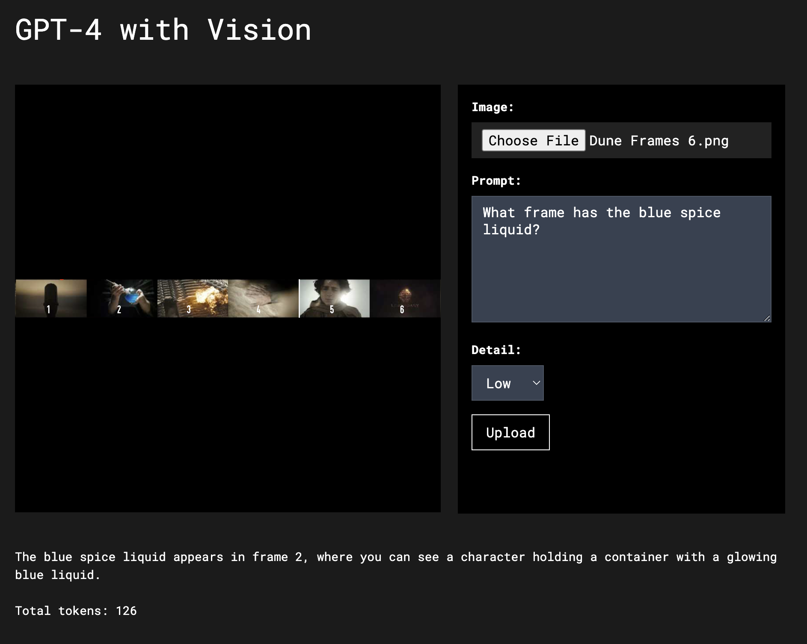

# GPT-4 with Vision Interface

This Python Flask application serves as an interface for OpenAI's GPT-4 with Vision API, allowing users to upload images along with text prompts and detail levels to receive AI-generated descriptions or insights based on the uploaded content.

From my blog post:
[How to use GPT-4 with Vision for Robotics and Other Applications](https://andrewmayne.com/?p=798)





## Features
- **Image Upload**: Users can upload images to be processed by the GPT-4 with Vision API.
- **Text Prompts**: Accompanying text prompts can be provided for more contextually relevant AI responses.
- **Detail Level Selection**: Users can select the level of detail (auto, low, high) they desire in the AI's response.
- **AJAX Form Submission**: The form is submitted using AJAX, providing a seamless user experience without page reloads.
- **Dynamic Image Preview**: Users can see a preview of the image they've selected or dragged into the upload area before submission.


## Setup
1. Clone the Repository
Clone this repository to your local machine.
2. Install Dependencies
   
Ensure you have Python installed, then set up a virtual environment and install the required packages:

```
   python -m venv venv
   source venv/bin/activate  # On Windows use `venv\Scripts\activate`
   pip install -r requirements.txt
```


3. **Environment Variables**
Create a .env file in the root directory and add your OpenAI API key:
```   
OPENAI_API_KEY=your_api_key_here
```

4. **Run the Application**
Start the Flask application:
```
python app.py
```

The application will be available at http://127.0.0.1:5006


## Usage

- Navigate to `http://127.0.0.1:5006` in your web browser.
- Use the form to select an image, enter a text prompt, and choose a detail level.
- Click the "Upload" button to submit the form.
- The selected image will be displayed in the `#imagePreview` area.
- While the request is being processed, a loader will be shown.
- Once the AI has processed the image and text, the response will be displayed on the page.

## Development
- **Frontend**: HTML, CSS (Tailwind), JavaScript (jQuery for AJAX requests)
- **Backend**: Python Flask
- **API**: OpenAI's GPT-4 with Vision